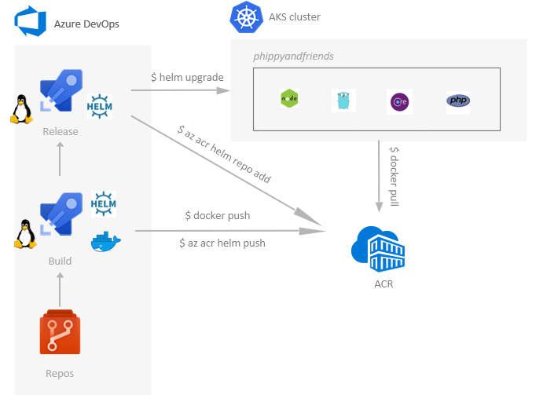
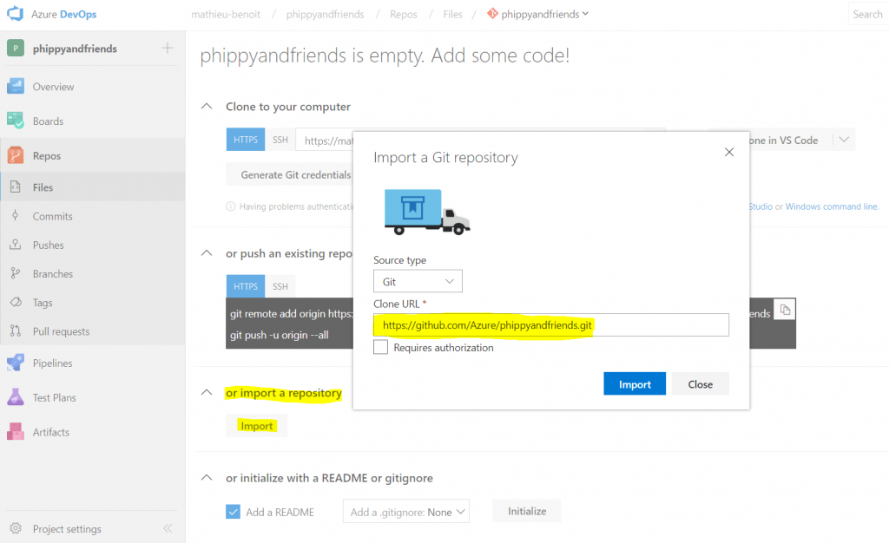
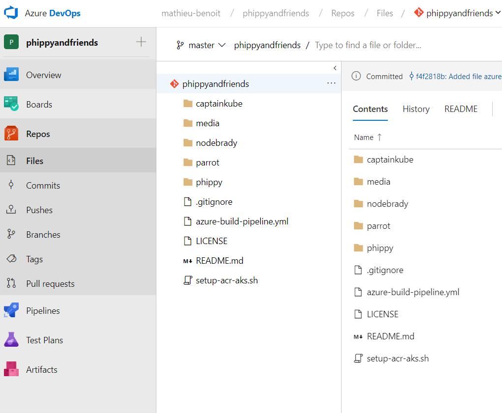
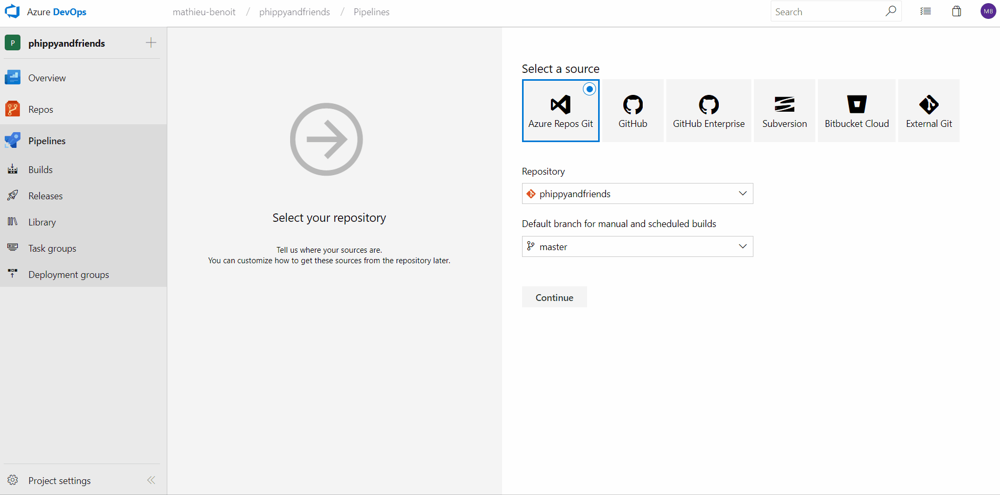
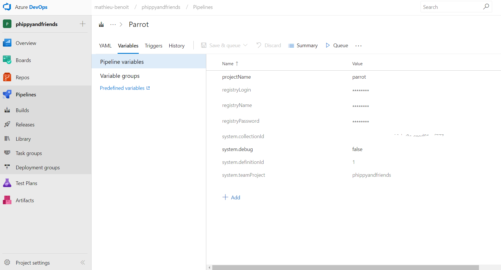
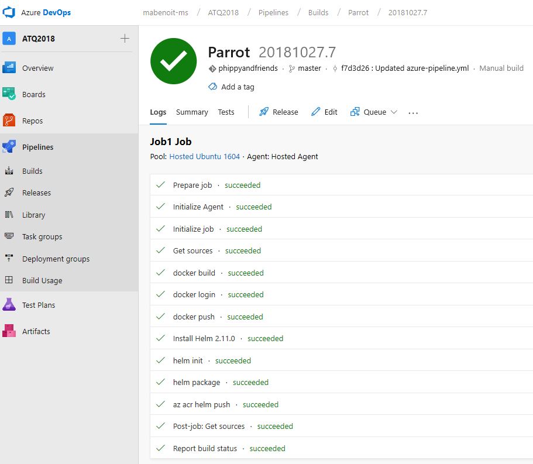
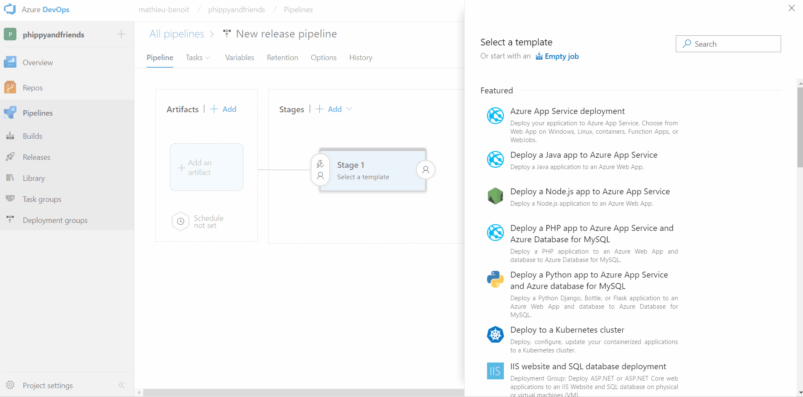
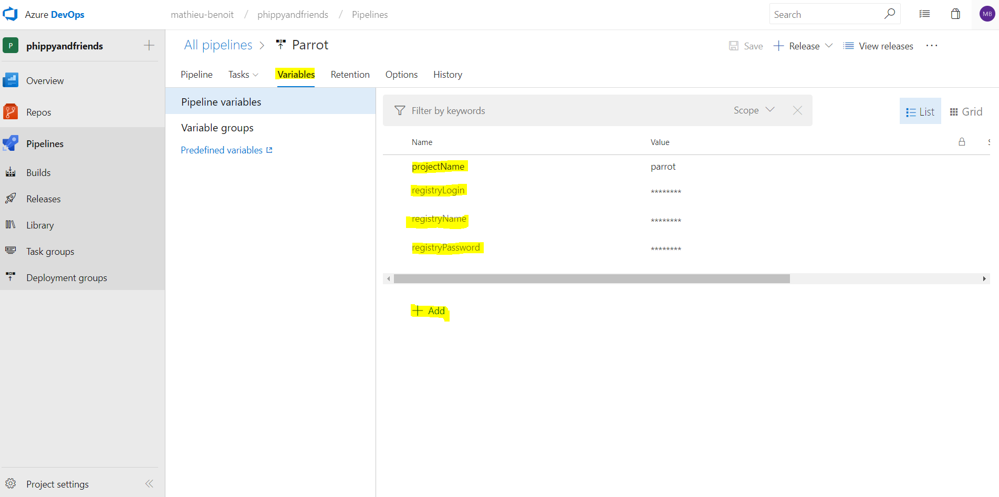
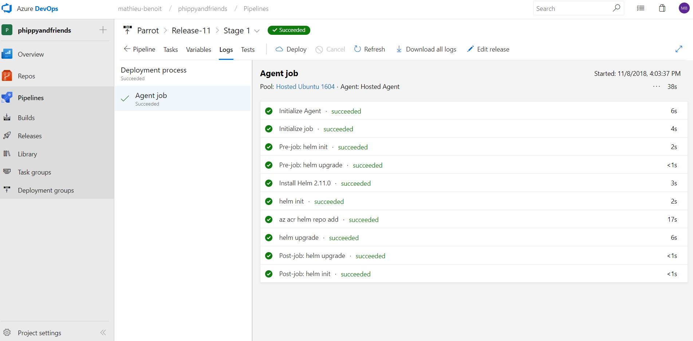
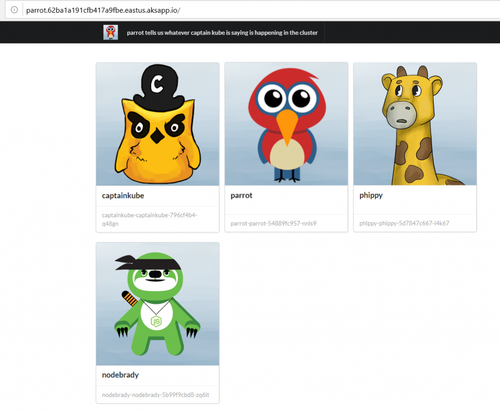

## Introduction

### Note: This is an adapted version of a tutorial found here: 
https://cloudblogs.microsoft.com/opensource/2018/11/27/tutorial-azure-devops-setup-cicd-pipeline-kubernetes-docker-helm/

The difference from the original is that we will reuse some of the resources created and used in the "main kubernetes workshop" from this repository.

In this tutorial, we will setup a CI/CD pipeline to deploy your apps on a Kubernetes cluster with Azure DevOps by leveraging a Linux agent, Docker and Helm. The combination of these technologies will illustrate how you can easily setup a CI/CD pipeline, leverage Configuration-as-Code and Infrastructure-as-Code, and accelerate your DevOps journey with containers.

Here are the technologies we’ll walk through, that were not already used in the "main workshop":

**Azure DevOps** helps to implement your CI/CD pipelines for any platform, any languages.

**Helm** simplifies and automates more your apps deployments in Kubernetes.


## Prerequisites & Setup
* Completed "main workshop" from this repository (but not the final "clean up" step!)
* Azure DevOps account: we will use an Azure DevOps project for a Git repo and build/release pipelines. Sign into your account here: https://azure.microsoft.com/en-us/services/devops/
 - After logging into your Azure DevOps account, simply click "New Project" in the top right corner, and select a name for the project (for instance "pippyandfriends") 
* Install Helm
````
$ kubectl create serviceaccount tiller --namespace kube-system
$ kubectl create clusterrolebinding tiller --clusterrole cluster-admin --serviceaccount=kube-system:tiller
$ kubectl create clusterrolebinding default-view --clusterrole=view --serviceaccount=<your namespace>:default
````


## The DevOps Workflow with Containers
This is the DevOps workflow with containers illustrated in this tutorial:

 

* Devs and Ops commit code change (apps, infrastructure-as-code, etc.) to Azure repos
* Azure build pipeline will build and push both the app as a Docker image and the Helm chart in an Azure Container Registry (ACR)
* Azure release pipeline will deploy the specific Helm chart to an Azure Kubernetes Service (AKS) cluster


## Source control
We will use the existing Azure/phippyandfriends GitHub repo. This repo has a few services, each of them representing an individual character of the Children’s Guide to Kubernetes and their new friend NodeBrady. Each service is written in a different language, showing how an AKS cluster can run anything you can bring it. Parrot is in .NET Core, CaptainKube is in Go, Phippy in PHP and NodeBrady in Node.js.

First, you will need to import this repo https://github.com/Azure/phippyandfriends into your own Azure repo. Click on "Repos", then on "Files" and select "import a repository":

 

Once imported you will be able to browse the source code of the four different apps: CaptainKube, NodeBrady, Parrot and Phippy:

 

Each app has its own folder and the same structure within it:

* **Files of the app itself**, depending of the programming languages: Parrot is in .NET Core, CaptainKube is in Go, Phippy in PHP and NodeBrady in Node.js.
* **Dockerfile file** is a script leveraged by Docker, composed of various instructions and arguments listed successively to automatically perform actions on a base image in order to create a new Docker image by packaging the app.
* **charts/* folder** contains the files defining Helm Chart of the app. Helm Charts helps you define, install and upgrade your app in Kubernetes.

With the next section we will also leverage the azure-build-pipeline.yml which plays an important role as Configuration-as-Code for the Azure build pipeline definition.

## Create a Build pipeline
We will now create an Azure build pipeline for the Parrot app to be able to both build/push its Docker image and package/push its Helm chart. For that we will need to create a build pipeline definition using the azure-build-pipeline.yml file. From the menu Pipelines > Builds, follow the steps illustrated below:
 

Then, you need to add some Variables for this build pipeline definition by providing your own values:

* projectName
  - Since we are setting this up for the Parrot project, just put: parrot (must be lower case)
* registryLogin
  - You could get it by running this command from Azure Cloud Shell: ````az acr credential show -n acr-name --query username````
* registryName
  - You could get it by running this command from Azure Cloud Shell: ````az acr show -n acr-name --query name````
* registryPassword
  - You could get it by running this command from Azure Cloud Shell: ````az acr credential show -n acr-name --query passwords[0].value````

### Hint: 
````
Mats Iremark [9:30 AM]
We have a container registry just for this workshop. Its url is workshopaks.azurecr.io and credentials are user: workshopaks password: leTIet6Z3A+xBsdK6GTNqrikn1V8ouLF
````

 

You could now Save & Queue a new build which will push both the Docker image and the Helm chart in your ACR.

 

From there you can run some Azure CLI commands from Azure Cloud Shell to check what you pushed in ACR:
````
# List Docker images from your ACR
$ az acr repository list -n acr-name
# List Helm charts from your ACR
$ az acr helm list -n acr-name
# Show details of a specific Helm chart from your ACR
$ az acr helm show chart-name -n acr-name
````

Now both the Docker image and the Helm chart could be used for any Kubernetes cluster from anywhere: locally, etc. You will see in the next section how to use them with a release pipeline.

## Create a Release pipeline
We will now create an Azure release pipeline for the Parrot app to be able to deploy it via its associated Helm chart. From the menu Pipelines > Releases, follow the steps illustrated below:
 

You can now reorder the tasks, select each task, and update the different fields with this info below:

* **Helm tool installer** – ````Install Helm 2.11.0````
  - Helm Version Spec: 2.11.0
  - Check for latest version of Helm: false
* **Package and deploy Helm charts** – ````helm init````
  - Connection Type: Kubernetres Service Connection or Azure Resource Manager
  - Command: init
  - Upgrade Tiller: true
  - Wait: true
  - Arguments: --service-account tiller
* **Bash**: ````az acr helm repo add````
  - Type: Inline
  - Script: az acr helm repo add -n $(registryName) -u $(registryLogin) -p $(registryPassword)
* **Package and deploy Helm charts** – ````helm upgrade````
  - Connection Type: Kubernetres Service Connection or Azure Resource Manager
  - Command: upgrade
  - Chart Type: Name
  - Chart Name: $(registryName)/$(projectName)
  - Release Name: $(projectName)
  - Namespace: <your namespace>
  - Install if release not present: true
  - Wait: true

Arguments: ````--version $(build.buildId) --set image.repository=$(registryName).azurecr.io/$(projectName) --set image.tag=$(build.buildId) --set image.private=true --set image.username=$(registryLogin) --set image.password=$(registryPassword) --set ingress.enabled=false````

 

Then, you need to add some Variables for this release pipeline definition by providing your own values:

* projectName
  - Since we are setting this up for the Parrot project, just put: parrot (must be lower case)
* registryLogin
  - You could get it by running this command from Azure Cloud Shell: ````az acr credential show -n acr-name --query username````
* registryName
  - You could get it by running this command from Azure Cloud Shell: ````az acr show -n acr-name --query name````
* registryPassword
  - You could get it by running this command from Azure Cloud Shell: ````az acr credential show -n acr-name --query passwords[0].value````

 

You can now Save and Release > Create a Release to run this release pipeline, which will deploy the Parrot’s Helm chart.

 

Once deployed successfully, you can now run this command from your Azure Cloud Shell to get the EXTERNAL-IP value of the service/parrot-parrot:

$ kubectl get all -n <your namespace>

Then, open a web browser to navigate to the "External IP" from the command above.
 

Congratulations! You have deployed the Parrot app on your Kubernetes cluster via a Helm Chart. With the next section you will see how to deploy the other apps/friends.

## Where are Phippy and the other friends?
You are right, we just have the Parrot app so far! You could now Clone both Parrot’s Build and Release pipelines definitions you created and adapt them with CaptainKube, Phippy and NodeBrody. Don’t forget these Build and Release pipelines definitions are generic, you just have to change the projectName variable in the Variables section.

You should now have four build definitions and four release definitions that you can now run to eventually see the Parrot app showing its friends:

 

Conclusion
Congratulations! You have deployed 4 different apps in a Kubernetes cluster by leveraging Azure DevOps, Azure Container Registry, Azure Kubernetes Service, Docker and Helm! You have also used Azure Cloud Shell to run some Azure and Kubernetes commands.

 

As illustrated throughout this tutorial, all together the technologies used will help you create a generic, strong and robust DevOps pipeline to deploy your apps from any languages to any platform. There are three central pieces simplifying the collaboration between the developers and the IT Pros – it’s about Configuration-as-Code and Infrastructure-as-Code:

* **Dockerfile** as the description of the packaging of your app
* **Helm chart** as the description of the deployment of your app on Kubernetes
* **YAML Build pipeline** as the description of the build process in Azure DevOps

Note: Release pipeline as YAML file is coming soon.

