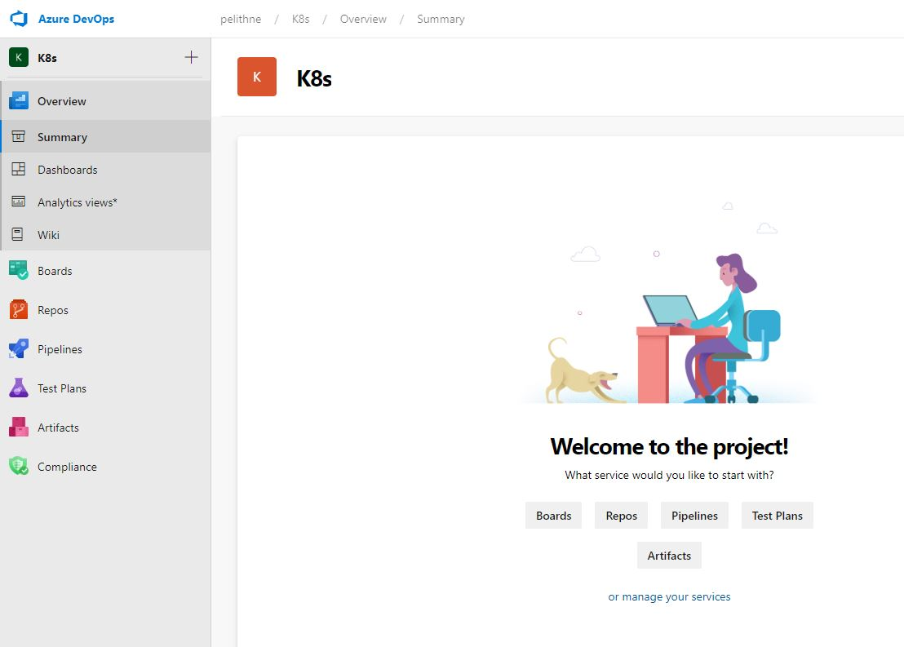
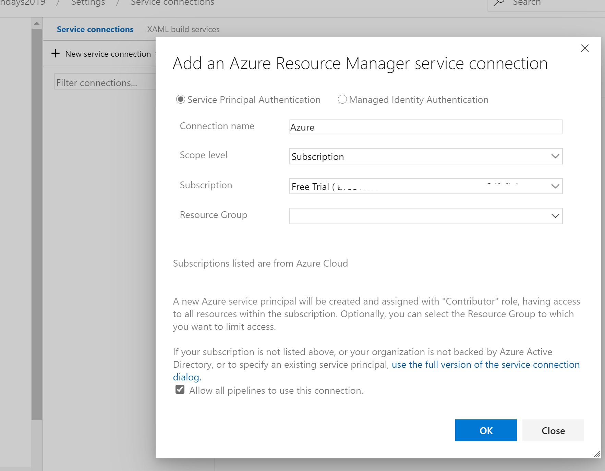
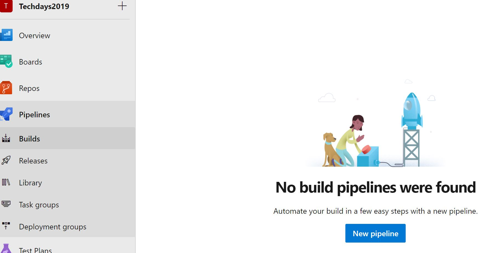
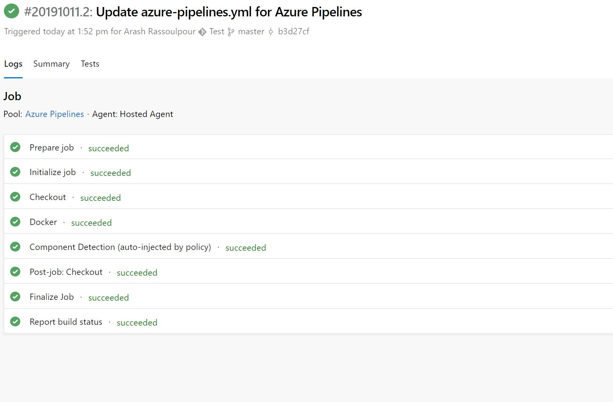
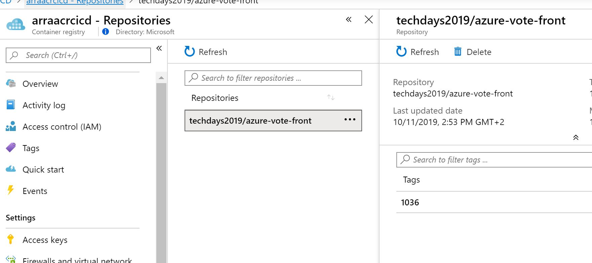
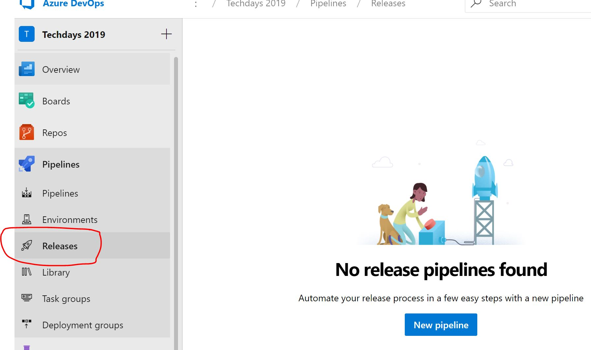
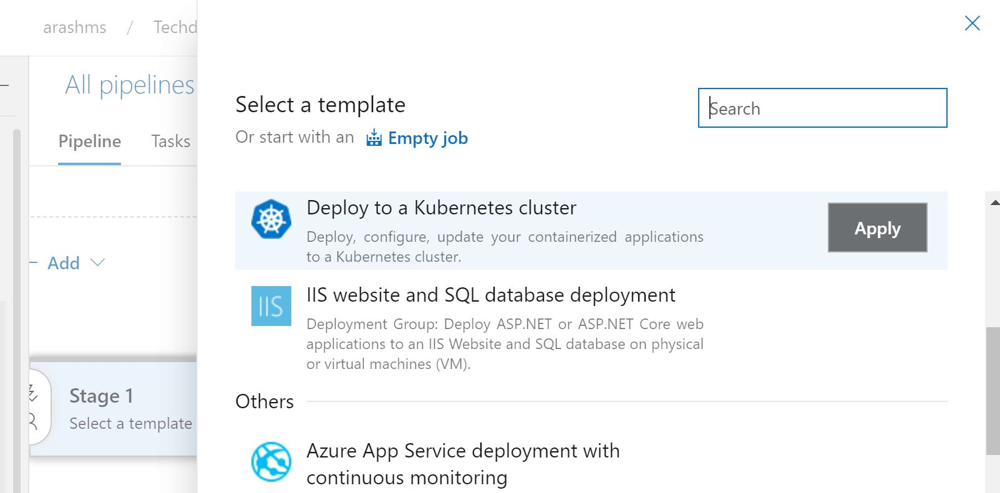
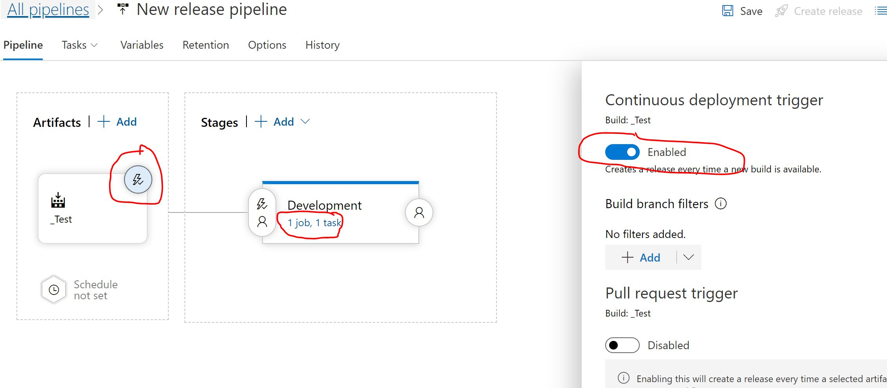
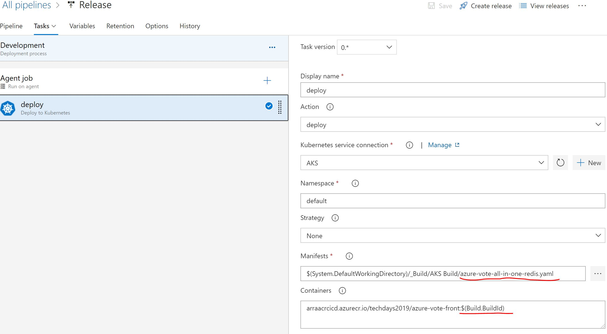
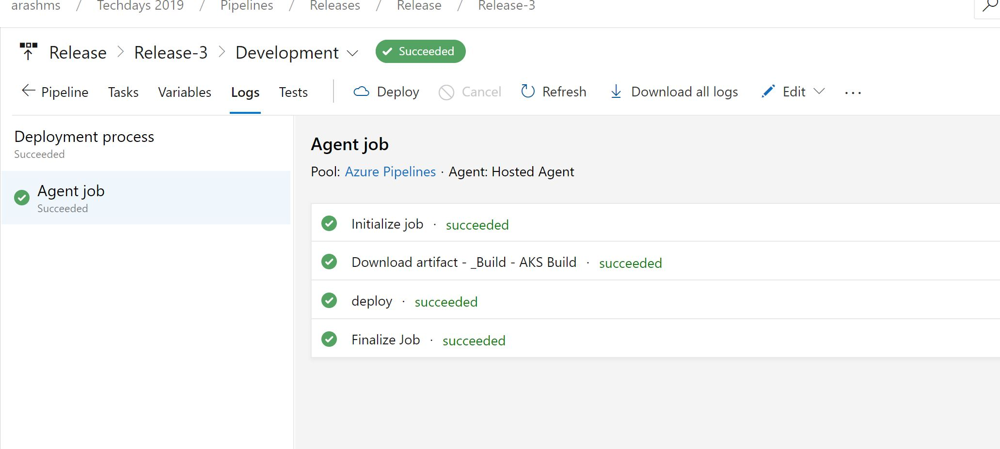

# TechDays pre-day Kubernetes and DevOps

This workshop/tutorial contains a number of different sections, each addressing a specific aspect of running workloads (containers) in Kuberntetes, and creating pipelines in Azure DevOps. 

You will go through the following steps to complete the workshop:
* Create a VM (Virtual machine) to use as your development envirfonment
* Create Kubernetes Cluster using AKS (Azure Kubernetes Service)
* Build and test docker images "locally" on your development VM
* Push images to ACR (Azure Container Registry)
* Deploy application to Kubernetes
* Setup CI/CD pipelines using Azure DevOps
* Use Helm to create templated Kubernetes applications
* and more...
 
## Development VM
You will use a virtual machine with Ubuntu, to perform most of the excercises in the workshop. In order to make this easy, we provide a script that will set this VM up for you, with the tools required. 

#### Note: if you want to run excercises locally on your laptop, you can do that. You will need the right tools (az cli, kubectl, docker, git, ssh). If you choose to do it this way, you are going to have to sort out a lot of things on your own. Some help can be found here: https://github.com/pelithne/kubernetes-workshop/blob/master/preparations.md


### Create the development VM
You can run the scripts to start the VM anywhere you like, but for simplicity we sugguest that you use the ````Azure Cloud Shell````

Start cloud shell by typing the address ````shell.azure.com```` into your browser. If you have not used cloud shell before, you will be asked to create a storage location for cloud shell. Accept that and make sure that you run ````bash```` as your shell (not powershell)

When the shell is up and running, you need to clone the repository that contains the configuration files and scripts to use to create the development VM.

````
git clone https://github.com/pelithne/techdays2019.git/
````

Then change directory to the cloned repo, and then go to the ````vmsetup```` directory

````
cd techdays2019
cd vmsetup
````

Before you can create the VM, you need to create a ````Resource Group````, which is where all your resources will be located. The name of the Resource Group can be anything you like (within reason...). 

The command below creates a Resource Group named "techdays" and places it in the ````West Europe```` region (Amsterdam).

````
az group create -n techdays -l westeurope
````

Now you can create the Development VM. The command below creates a VM deployment named "dev" in the Resource Group "techdays" you created in the previous step. It also uses an ````ARM Template```` to configure the VM with the right operating system and tools (ubuntu.json).

````
az group deployment create -n dev -g techdays --template-file ubuntu.json
````

When applying this command, you will get a few questions:

* Please provide string value for 'adminUsername' (? for help): 
* Please provide securestring value for 'adminPassword' (? for help): (min 8 characters, at least one upper case and one special character)
* Please provide string value for 'vmName' (? for help):


After questions are answered, the VM will be created, and the script located in config.sh will be automatically downloaded from ``github`` and executed. Because of this, the VM creation will take a bit longer than usual. **Coffee time?**

### Login to VM
When VM creation is completed, you can login to the VM either using the output line that describes how to ssh into the machine (look for ````ssh```` ), e.g.
````
"sshCommand": {
        "type": "String",
        "value": "ssh <adminUsername>@techdays1972t6imtd2wocm.westeurope.cloudapp.azure.com"
````

Or find the right url or ip by going to the Azure Portal and selecting the VM that was just created. In the toolbar for the current blade, you will find a connect icon. Click that icon to get instructions on how to connect.

You can log in from the Azure Cloud Shell or by using ssh from your laptop (if you have an ssh client). The disadvantage with using cloud shell, is that the session times out after 15-20 minutes of inactivity, so you might get logged out from time to time. 

Log into your Development VM
````
ssh <adminUsername>@<texchdaysNNNXXXX>.westeurope.cloudapp.azure.com
```` 

## Build and run containers on your development machine

In this step in the tutorial, you will prepare a multi-container application for use in your development environment. Existing tools such as Git and Docker are used to locally build and test an application. You will learn how to:

 * Clone a sample application source from GitHub 
 * Create a container image from the sample application source
 * Test the multi-container application in a local Docker environment

Once completed, the following application will run in your local development environment:

 


### Get application code

The sample application used in this tutorial is a basic voting app. The application consists of a front-end web component and a back-end Redis instance. The web component is packaged into a custom container image. The Redis instance uses an unmodified image from Docker Hub.

The application code is located under **application**  in the same repository from which you are currently reading this instruction. Use ```git``` to clone the repository to your development environment.

#### Note: you have already done this before, but that was in the cloud shell. YOu need to clone the repository to your Development VM as well.

```console
git clone https://github.com/pelithne/techdays2019
```

Change directories so that you are working from the cloned directory, and then ````cd```` into ````application/azure-vote-app```` which is where the application code is located.

```console
cd techdays2019

cd application/azure-vote-app
```

Inside the directory you will find the application source code, a pre-created Dockerfile and a Kubernetes manifest. These files will be used throughout the tutorial.

### Create a docker network

This network will be used by the containers that are started below, to allow them to communicate with each other

```console
sudo docker network create mynet
```

### Create container images

Build azure-vote-front, using the Dockerfile located in ./azure-vote. This will create two images, one base image and one for the azure-vote-front.

```console
sudo docker build -t azure-vote-front .
```
Please review ./azure-vote/Dockerfile to get an understanding of how the container images are created based on this file (take the time; it's a small file!).

### Run the application on your development machine
First start the redis cache container (the back-end container). The command below will start a container with name "azure-vote-back" using the official redis docker image. The app will use the network ´´´mynet´´´ created in the previous step. If this is the first time the command is executed, the image will be downloaded to your computer (this can take a while). 

```console
sudo docker run -d --name azure-vote-back --net mynet redis
```

Now start the frontend container. The command below will start a container with name "azure-vote-front" using the previously built container. Additionally port 80 will be exposed (so that the application can be accessed using a browser) and insert an environment variable ("REDIS") that will be used to connect to the redis cache.
```console
sudo docker run --name azure-vote-front -d -p 80:80 --net mynet -e "REDIS=azure-vote-back" azure-vote-front
```

When completed, use the ```docker images``` command to see the created images. Three images have been downloaded or created. The *azure-vote-front* image contains the front-end application and uses the `nginx-flask` image as a base. The `redis` image is used to start a Redis instance.

```
$ sudo docker images

REPOSITORY                   TAG                   IMAGE ID            CREATED             SIZE
azure-vote-front             latest                00c4df2b3d4b        11 minutes ago      192MB
redis                        latest                5958914cc558        11 days ago         94.9MB
tiangolo/uwsgi-nginx-flask   python3.6-alpine3.8   6266b62f4b60        2 weeks ago         192MB
```

To see the running containers, run ```docker ps```:

```
$ sudo docker ps

CONTAINER ID        IMAGE             COMMAND                  CREATED             STATUS              PORTS                           NAMES
82411933e8f9        azure-vote-front  "/usr/bin/supervisord"   57 seconds ago      Up 30 seconds       443/tcp, 0.0.0.0:8080->80/tcp   azure-vote-front
b68fed4b66b6        redis             "docker-entrypoint..."   57 seconds ago      Up 30 seconds       0.0.0.0:6379->6379/tcp          azure-vote-back
```

### Test application
The application you started in the previous step runs on your development machine in Azure. The VM you created has a public IP address, and this is what you should use to access the application.

To find the public IP of your VM, you can check in the Azure Portal. Navigate to the VM that was created in the beginning of the workshop. In the ````Overview```` look for the  ````Public IP address```` 

To see the running application, enter http://\<VM Public IP address> in a local web browser.

If all goes well, the sample application loads, as shown in the following example:


### Clean up resources

Now that the application's functionality has been validated, the running containers can be stopped and removed. Do not delete the container images - in the next step, the *azure-vote-front* image will be uploaded to an Azure Container Registry.

Stop and remove the container instances:

```console
sudo docker stop azure-vote-front azure-vote-back
sudo docker rm azure-vote-front azure-vote-back
```

## Moving it all to K8S
Now you have tried running your dockerized application on your dev machine. In the next steps you will go through the steps needed to deploy it in **Azure Kubernetes Service**.

### Login to azure
To be able to use the Azure CLI, you need to be logged in to Azure. Do that by running the following command, and then follow the instructions.
````
az login
````

### Azure Container Registry

You will create a private Azure Container Registry to store the images that you will deploy to Kubernetes. The name of the the ACR needs to be globally unique. You could for instance use your corporate signum.

````
az acr create --name <your unique name> --resource-group techdays --sku basic
````


### Login to Container Registry

In order to use the registry, you must first login. 

Use the ```az acr login``` command and provide the name given to the container registry. 

```azurecli
sudo az acr login --name <your unique name>
```

The command returns a *Login Succeeded* message once completed.

### Create Kubernetes Cluster
Create an AKS cluster using ````az aks create````. Give the cluster a nice name, and run the following command (assuming that you named your resource group as suggested in a previous step, ````techdays````):
 
```` 
az aks create --resource-group techdays --name <Your AKS name> --disable-rbac --generate-ssh-keys --attach-acr techdays2019
````

The creation time for the cluster can be up to 10 minutes, so lets move on...


### Tag a container image

To see a list of your current **local** images on your deveopment machine, once again use the ```docker images``` command:

```
$ sudo docker images

REPOSITORY                   TAG                   IMAGE ID            CREATED             SIZE
azure-vote-front             latest                00c4df2b3d4b        11 minutes ago      192MB
redis                        latest                5958914cc558        11 days ago         94.9MB
tiangolo/uwsgi-nginx-flask   python3.6-alpine3.8   6266b62f4b60        2 weeks ago         192MB
```

To use the *azure-vote-front* container image with ACR, the image needs to be tagged with the login server address of your registry. This tag is used for routing when pushing container images to an image registry. The login server will be: `<your unique name>.azurecr.io`

Finally, to indicate the image version, add *:v1* to the end of the image name.

The resulting command:

```console
sudo docker tag azure-vote-front <your unique name>.azurecr.io/azure-vote-front:v1
```

To verify the tags are applied, run ```docker images``` again. A new image will have appeared, that is tagged with the ACR address, a unique name and a version number.

```
azure-vote-front                                   latest                00c4df2b3d4b        11 minutes ago      192MB
pelithneacr.azurecr.io/azure-vote-front            v1                    00c4df2b3d48        11 minutes ago      192MB
redis                                              latest                5958914cc558        11 days ago         94.9MB
tiangolo/uwsgi-nginx-flask                         python3.6-alpine3.8   6266b62f4b60        2 weeks ago         192MB
```

### Push images to registry

You can now push the *azure-vote-front* image to your ACR instance. Use ```docker push``` as follows:

```console
 sudo docker push <your unique name>.azurecr.io/azure-vote-front:v1
```

It may take a few minutes to complete the image push to ACR.

### List images in registry

To return a list of images that have been pushed to your ACR instance, use the ```az acr repository list``` command:

```azurecli
az acr repository list --name <your unique name> --output table
```

You now have a container image that is stored in an Azure Container Registry. This image will be deployed from ACR to a Kubernetes cluster in the next step.

## Run applications in Azure Kubernetes Service (AKS)

Kubernetes provides a distributed platform for containerized applications. You build and deploy your own applications and services into a Kubernetes cluster, and let the cluster manage the availability and connectivity. In this step a sample application is deployed into a Kubernetes cluster. You will learn how to:

 * Update Kubernetes manifest files
 * Run an application in Kubernetes
 * Test the application
 

#### Validate towards Kubernetes Cluster

In order to use `kubectl` you need to connect to the Kubernetes cluster, using the following command:
```console
az aks get-credentials --resource-group techdays --name <your AKS name>
```

#### Update the manifest file

You have uploaded a docker image with the sample application, to an Azure Container Registry (ACR). To deploy the application, you must update the image name in the Kubernetes manifest file to include the ACR login server name. The manifest file to modify is the one that was downloaded when cloning the repository in a previous step. The location of the manifest file is in the ./application directory

````
cd application
````

The sample manifest file from the git repo cloned in the first tutorial uses the login server name of *microsoft*. Open this manifest file with a text editor, such as `vi`:

```console
vi azure-vote-all-in-one-redis.yaml
```

Replace *microsoft* with your ACR login server name. The following example shows the original content where you need to replace the **image**:

```yaml
containers:
- name: azure-vote-front
  image: microsoft/azure-vote-front:v1
```

Provide the ACR login server so that your manifest file looks like the following example:

```yaml
containers:
- name: azure-vote-front
  image: <Your ACR Name>.azurecr.io/azure-vote-front:v1
```

Please also take some time to study the manifest file, to get a better understanding of what it contains.

Save and close the file.

### Deploy the application

To deploy your application, use the ```kubectl apply``` command. This command parses the manifest file and creates the defined Kubernetes objects. Specify the sample manifest file, as shown in the following example:

```console
kubectl apply -f azure-vote-all-in-one-redis.yaml
```

### Test the application

A kubernetes-service is created which exposes the application to the internet. This process can take a few minutes, in part because the container image needs to be downloaded from ACR to the Kubernetes Cluster. In order to monitor the progress of the download, you can use ``kubectl get pods`` and ``kubectl describe pod``, like this:

First use ``kubectl get pods`` to find the name of your pod:
```consolse
kubectl get pods
```

Then use ``kubectl describe pod`` with the name of your pod:
```consolse
kubectl describe pod <pod name>
```

You can also use ``kubectl describe`` to trouble shoot any problems you might have with the deployment (for instance, a common problem is **Error: ErrImagePull**, which can be caused by incorrect credentials or incorrect address/path to the container in ACR. It can also happen if the Kubernetes Cluster does not have read permission in the Azure Container Registry.

Once your container has been pulled and started, showing state **READY**, you can instead start monitoring the service to see when a public IP address has been created.

To monitor progress, use the `kubectl get service` command with the `--watch` argument:

```console
kubectl get service azure-vote-front --watch
```

The *EXTERNAL-IP* for the *azure-vote-front* service initially appears as *pending*, as shown in the following example:

```
azure-vote-front   10.0.34.242   <pending>     80:30676/TCP   7s
```

When the *EXTERNAL-IP* address changes from *pending* to an actual public IP address, use `CTRL-C` to stop the kubectl watch process. The following example shows a public IP address is now assigned:

```
azure-vote-front   10.0.34.242   52.179.23.131   80:30676/TCP   2m
```

To see the application in action, open a web browser to the external IP address.


In the next step you will learn how to use Kubernetes DevOps features.


## Azure DevOps with AKS


In this step you will make a CI/CD pipeline for the AKS cluster. You will learn how to:  

* Automatically build an application on check-in 
* Automatically build the docker container for the application
* Autamtically deploy the docker container to AKS


### Register an account at Azure DevOps

You can create a free Azure DevOps account at: <https://azure.microsoft.com/en-us/services/devops/>. Azure DevOps is SaaS service from Microsoft. You need a Microsoft account to get started. If you do not have one you can create a free account here: <https://account.microsoft.com/account?lang=en-us>

Once you have logged in to your Azure Devops account, you will create a **project**. Give the project a name, like "Techdays 2019"

You should now have project like this:



The left hand side shows you:

* **Overview** - overview of the Azure DeOps project like wiki, dashboards and more
* **Boards** - supporting a Agile workmethology with sprints and backlog
* **Repos** - your source code
* **Pipelines** - you build and release - the essance of CI/CD
* **TestPlans** - you testing overview
* **Artifacts** - your build artifacts that you might share in other projects, like nuget packages and such.

### Create your Repository

Click on "Repos".

Select "import a repository"
<p align="left">
  
</p>

Then type in the URL to the repository (this is becoming familiar by now... :-) ): https://github.com/pelithne/techdays2019
<p align="left">
  
</p>

When the import is finished, you will have your own version of the repository in Azure Devops. The parts that you will work with in this part of the tutorial are located in the ````application```` folder.

### Connect Azure and Azure DevOps

Make sure you are using the same account in both Azure and Azure DevOps (same email addess).

With the **same account**, it's important to have the same account logged in at the same time because it will link the same account Id on both ends.

* Login to Azure portal: https://portal.azure.com

* Login to Azure DevOps: https://dev.azure.com/

In Azure DevOps, connect you Azure Subscription by the following instruction: <https://docs.microsoft.com/en-us/azure/devops/pipelines/library/connect-to-azure?view=azure-devops#create-an-azure-resource-manager-service-connection-using-automated-security>. Create 2 connections from Azure DevOps to Azure:

1. Azure Resource Manager - to deploy anything in Azure in any resource group
2. Docker Service Registry Connection - enables deployment from the pipeline to a docker registry. In our case, the Docker Registry is the Azure Container Registry you created in a previous step.




Click OK and login with your account and the link between Azure and Azure DevOps is created.

Create an service connection with the Azure Container Registry in the same page, this will bind a conneciton from Azure DevOps to your container registry to build and save your images:


### Create Build and Release Pipelines

We are going to:

* Create a build pipeline
* Create a release pipeline that is chained to the build pipeline

Go to Pipelines and create a new pipeline:



Choose "Azure Repos Git" and then select your repository that you have pushed to Azure DevOps Repo.

It will automatically select the **azure-pipelines.yml** file that is part of the repository. It contains a Yaml file with the configuration of a build. We will change this definition so don't bother about the syntax in the file for now.


<p align="left">
  
</p>

Run the pipeline and see the steps in the build, it will fail since we are not done with the configuration.

#### Build Pipeline

To make a build we need to follow the same steps you have done manually:

1. Go to your new Pipeline
2. Now edit the pipeline and type "docker" in the search bar. Fill in the details and press ok.

<p align="left">
  
</p>

<p align="left">
  
</p>

The final yaml file should looke similar to this:

```yaml
trigger:
- master

pool:
  vmImage: 'Ubuntu-16.04'

steps:
- task: Docker@2
  inputs:
    containerRegistry: 'Azure Container Registry'
    repository: techdays2019/azure-vote-front
    command: 'buildAndPush'
    Dockerfile: '**/Dockerfile'
    tags: $(Build.BuildId)
```

* trigger: will automatically trigger on checkin in master branch

* pool: the vm type the build will be conducted on

* task: the actual build task, in this case Docker build, more information about the task can be found: <https://docs.microsoft.com/en-us/azure/devops/pipelines/tasks/build/docker?view=azure-devops>

* containerRegistry: your Azure Container Registy

* repository: the repository inside Azure Container Registy to store your Docker image

* command: both build and push the image

* Dockerfile: the path and name to the Dockerfile. '**' will start searching in the directory specified

* tags: the Docker build tag to be appended. $(Build.BuildId) is an predefined environment variable in Azure DevOps that is incremeted at every build, more information about Azure DeOps built in environment variables can be found here: <https://docs.microsoft.com/en-us/azure/devops/pipelines/build/variables?view=azure-devops&tabs=yaml>

The Release stage requires that the release pipeline has access to the manifestfile which is doen't have because the build stage has not delivered any result. In order to acheive that let's add another step to our build pipeline called "Copy and Publish Build Artifacts".

Open and edit the build definition again and add "Copy and Publish Build Artifacts".

<p align="left">
  
</p>

The manifest file will get edited in the release pipeline to point to a specific image with a specific BuildId.

Add the "azure-vote-all-in-one-redis.yaml" to the contents, the final Build definition should look similar to wthe the new task: CopyPublishBuildArtifacts@1.

```yaml
trigger:
- master

pool:
  vmImage: 'Ubuntu-16.04'

steps:
- task: Docker@2
  inputs:
    containerRegistry: 'Azure Container Registry'
    repository: techdays2019/azure-vote-front
    command: 'buildAndPush'
    Dockerfile: '**/Dockerfile'
    tags: $(Build.BuildId)

- task: CopyPublishBuildArtifacts@1
  inputs:
    Contents: 'azure-vote-all-in-one-redis.yaml'
    ArtifactName: 'AKS Build'
    ArtifactType: 'Container'

```

This will give you ability to grab the "azure-vote-all-in-one-redis.yaml" file in the build repository as you will see in the release section to finalize the release.

Save the build pipeline and let it run. Then rename the build pipeline to "Docker build and push" by click on the "..." in the right corner.


Start the build and watch the repository in the Azure Container Registry in Azure to see the new build image has been added.



Open Azure portal and the Azure Container Registry and you will find the image of the build with it's build id coming from the build pipeline. The "azure-vote-front" is the service you just built.



#### Release Pipeline

You just built and pushed the service azure-vote-front to Azure Container Registry. The next step is to deploy the container into AKS.

Let's start with creating a Release pipeline. Got to "Pipelines->Releases" and click on "New Release".



Select "Deploy to Kubernetes to a Kubernetes cluster".



Give the stage name "Development" and save it.


<p align="left">
  
</p>

Click on the "Add" artifacts and choose the build pipeline "Test" we created earlier. We now have the build pipeline chained with the release pipeline. To make the build and deployment be triggered in a chain of events, click on the lightning and enable "Continuous deployment trigger". To enter the Release pipeline, click on the "1 job, 1 task".



Add another step in the build definition by selecting "Deploy to Kubernetes" in the right pane, make sure to choose the one containing "manifest file", see picture below:


Fill in the details and make sure the $(Build.BuildId) is filled in the "Containers" section. This will override the image in the the manifest and update to the latest build that triggered the release, hence carrying the BuildId with itself in the pipeline. Everytime a build is triggered due to any change in the master branch, the change will Docker build a new image with a tag specified by BuildId. The image will be pushed to Azure Container Registry and eventually, the "deploy" stage will update the "azure-vote-all-in-one.yaml" with the new image that contains the tag BuildId and deploy it into AKS. Hence, full automatic pipeline for build and deploy.

Fill in the details like the example below:



Now go back to the Build pipeline and build it and watch the build pipeline start first and when it's sucessessfully finished, starting the release pipeline. 

### All-In-One

Let's change some code and watch the whole chain roll from Code commit ->Build->Release. 

Open the file: azure-vote-app/azure-vote/config_file.cfg and change the code:

```py
# UI Configurations
TITLE = 'Azure Voting App'
VOTE1VALUE = 'Yellow'  <-- changed
VOTE2VALUE = 'Pink'    <-- changed
SHOWHOST = 'false'
```

Watch the Build and Release pipeline finalize.




<p align="left">
  
</p>

Watch the build automatically triggered in Azure DevOps. 

If you get errors, you might need to set the permission for the AKS cluster to pull images from AKS. This can be done by the following command (<https://docs.microsoft.com/en-us/cli/azure/ext/aks-preview/aks?view=azure-cli-latest>)

```console

az aks update -n <name of AKS cluster> -g <resource group of AKS> --attach-acr <name of Azure Container Registry>

```

To use the Kubernetes dashboard, enable permission for the cluster-admin:
For more information about the Kubernetes dashboard: <https://kubernetes.io/docs/tasks/access-application-cluster/web-ui-dashboard/>

```console

kubectl create clusterrolebinding kubernetes-dashboard -n kube-system --clusterrole=cluster-admin --serviceaccount=kube-system:kubernetes-dashboard

```

To start the Kubernetes dashboard:

```console

az aks browse --resource-group <resource group of AKS> --name <name of AKS cluster>

```

Click on the IP-address and port that is exposed from the cluster:


To see the change in the application we need the public endpoint of the application. Run the kubectl command to get the service endpoint:

```console
>kubectl get services
NAME               TYPE           CLUSTER-IP     EXTERNAL-IP      PORT(S)        AGE
azure-vote-back    ClusterIP      10.0.208.112   <none>           6379/TCP      2d23h
azure-vote-front   LoadBalancer   10.0.243.181   52.233.236.177   80:31448/TCP  2d23h
kubernetes         ClusterIP      10.0.0.1       <none>           443/TCP       5d6h

```

Open the public IP-addess, in this case 52.233.236.177 and watch the Yellow and Pink buttons have changed.


<p align="left">
  
</p>

#### Alternative solution - Release Pipeline & Future improvement

Azure DevOps is constantly developing. One future improvement is to have build and release configurations in the same place. The feature is currently in preview and in order to enable multistage pipelines, read this: <https://devblogs.microsoft.com/devops/whats-new-with-azure-pipelines>

Here is an example of multistage pipeline:

```yaml
trigger:
- master

pool:
  vmImage: 'Ubuntu-16.04'


stages:
- stage: 'Build_Development'
  jobs:
  - job:
    steps:
    - task: Docker@2
      inputs:
        containerRegistry: 'Azure Container Registry'
        repository: techdays2019/azure-vote-front
        command: 'buildAndPush'
        Dockerfile: '**/Dockerfile'
        tags: $(Build.BuildId)


# stage 'Release to Development' runs if 'Build Development' succeeds
- stage: 'Release_to_Development'
  condition: succeeded('Build_Development')
  jobs:
  - job:
    steps:
    - task: KubernetesManifest@0
      inputs:
        action: 'deploy'
        kubernetesServiceConnection: 'AKS'
        namespace: 'default'
        manifests: 'azure-vote-all-in-one-redis.yaml'
        containers: 'techdays2019/azure-vote-front:$(Build.BuildId)'
```


## Scale applications in Azure Kubernetes Service (AKS)

In this step you will scale out the pods in the app and try pod autoscaling.

* Use Azure DeOps to scale number of pods
* Manually scale Kubernetes pods that run your application
* Configure autoscaling pods that run the app front-end

### Azure DevOps to scale pods

You can use Azure DeOps to configure the number of pods in the cluster for one service. This is a very easy task since all of your infrastructure of Kubernetes resides within the "azure-vote-all-in-one-redis.yaml" file.

Open the "azure-vote-all-in-one-redis.yaml" file.

Change "replicas" from 1 to 4 and the commit the file. The commit will trigger an automatic build and deploy by running the DevOps pipeline you just defined earlier.

```yaml

apiVersion: apps/v1beta1
kind: Deployment
metadata:
  name: azure-vote-front
spec:
  replicas: 4

```

Once you have committed the file, open Azure DevOps and watch the automatic build been triggered.


Once the build is finished you can now run kubectle and watch the number of pods, you should now have 4 "azure-vote-front-*" pods.

```console

>kubectl get pods
NAME                                READY   STATUS    RESTARTS   AGE
azure-vote-back-5b84769c69-z4r7j    1/1     Running   0          2d16h
azure-vote-front-55fb564887-fgl5t   1/1     Running   0          2m15s
azure-vote-front-55fb564887-s7vgv   1/1     Running   0          2m15s
azure-vote-front-55fb564887-tvjxd   1/1     Running   0          2m15s
azure-vote-front-55fb564887-xwd9t   1/1     Running   0          2d16h
>

```

### Manually scale pods

When the Azure Vote front-end and Redis instance were deployed in previous steps, a single replica was created. To see the number and state of pods in your cluster, use the `kubectl get` command as follows:

```console
kubectl get pods
```

The following example output shows one front-end pod and one back-end pod:

```
NAME                               READY     STATUS    RESTARTS   AGE
azure-vote-back-2549686872-4d2r5   1/1       Running   0          31m
azure-vote-front-848767080-tf34m   1/1       Running   0          31m
```

It is possible to use the ```kubectl scale``` command to scale the number of pods. However, the preferred way is to edit the kubernetes manifest to increase the number of replicas.

Open the sample manifest file `azure-vote-all-in-one-redis.yaml` from the previously cloned git repo and change `replicas` from 1 to 3, on line 34.

Change this:
 ```yaml
apiVersion: apps/v1beta1
kind: Deployment
metadata:
  name: azure-vote-front
spec:
  replicas: 1
  ````

To this:

  ```yaml
apiVersion: apps/v1beta1
kind: Deployment
metadata:
  name: azure-vote-front
spec:
  replicas: 3
  ````
  
And the run:

````
kubectl apply -f azure-vote-all-in-one-redis.yaml
````

Run `kubectl get pods` again to verify that Kubernetes creates the additional pods. After a minute or so, the additional pods are available in your cluster:

```console
$ kubectl get pods

                                    READY     STATUS    RESTARTS   AGE
azure-vote-back-2606967446-nmpcf    1/1       Running   0          15m
azure-vote-front-3309479140-2hfh0   1/1       Running   0          3m
azure-vote-front-3309479140-bzt05   1/1       Running   0          3m
azure-vote-front-3309479140-hrbf2   1/1       Running   0          15m
```

### Autoscale pods

Kubernetes supports horizontal pod autoscaling to adjust the number of pods in a deployment depending on CPU utilization or other select metrics. The metrics-server is used to provide resource utilization to Kubernetes, and is automatically deployed in AKS clusters versions 1.10 and higher. 

To use the autoscaler, your pods must have CPU requests and limits defined. In the `azure-vote-front` deployment, the front-end container requests 0.25 CPU, with a limit of 0.5 CPU. The settings look like:

```yaml
resources:
  requests:
     cpu: 250m
  limits:
     cpu: 500m
```

The following example uses the ```kubectl autoscale``` command to autoscale the number of pods in the *azure-vote-front* deployment. If CPU utilization exceeds 50%, the autoscaler increases the pods up to a maximum of 10 instances. In this case however, with almost no load on your application, it will instead scale down to the minimum number of pods (1).

```console
kubectl autoscale deployment azure-vote-front --cpu-percent=50 --min=1 --max=10
```

To see the status of the autoscaler, use the ```kubectl get hpa``` command as follows:

```
$ kubectl get hpa

NAME               REFERENCE                     TARGETS    MINPODS   MAXPODS   REPLICAS   AGE
azure-vote-front   Deployment/azure-vote-front   0% / 50%   3         10        3          2m
```

After a few minutes, with minimal load on the Azure Vote app, the number of pod replicas will decrease automatically. You can use `kubectl get pods` again to see the unneeded pods being removed.

## Update an application in Azure Kubernetes Service (AKS)

After an application has been deployed in Kubernetes, it can be updated by specifying a new container image or image version. When doing so, the update is staged so that only a portion of the deployment is concurrently updated. This staged update enables the application to keep running during the update. It also provides a rollback mechanism if a deployment failure occurs.

In this step the sample Azure Vote app is updated. You learn how to:

 * Update the front-end application code
 * Create an updated container image
 * Push the container image to Azure Container Registry
 * Deploy the updated container image

### Azure DevOps: Update an application

Let's make a change to the sample application, then update the version already deployed to your AKS cluster. The sample application source code can be found inside of the *azure-vote* directory. Open the *config_file.cfg* file with an editor, such as `vi`:

```console
vi azure-vote/azure-vote/config_file.cfg
```

Change the values for *VOTE1VALUE* and *VOTE2VALUE* to different colors. The following example shows the updated color values:

```
# UI Configurations
TITLE = 'Azure Voting App'
VOTE1VALUE = 'Blue'
VOTE2VALUE = 'Purple'
SHOWHOST = 'false'
```

Save and close the file.


### Update an application

Let's make a change to the sample application, then update the version already deployed to your AKS cluster. The sample application source code can be found inside of the *azure-vote* directory. Open the *config_file.cfg* file with an editor, such as `vi`:

```console
vi azure-vote/azure-vote/config_file.cfg
```

Change the values for *VOTE1VALUE* and *VOTE2VALUE* to different colors. The following example shows the updated color values:

```
# UI Configurations
TITLE = 'Azure Voting App'
VOTE1VALUE = 'Blue'
VOTE2VALUE = 'Purple'
SHOWHOST = 'false'
```

Save and close the file.

### Update the container image

To re-create the front-end image and test the updated application, use ```docker build``` the same way as in a previous step. 

```console
sudo docker build -t azure-vote-front ./azure-vote
```

### Test the application on your dev machine

First you need to start the application again, on your local machine using docker.

````
sudo docker run -d --name azure-vote-back --net mynet redis
sudo docker run --name azure-vote-front -d -p 80:80 --net mynet -e "REDIS=azure-vote-back" azure-vote-front
````

Then, to verify that the updated container image shows your changes, open a local web browser to http://<Public VM address>.


The updated color values provided in the *config_file.cfg* file are displayed on your running application.

### Tag and push the image

To correctly use the updated image, tag the *azure-vote-front* image with the login server name of your ACR registry, and your `<unique name>`.

Use ```docker tag``` to tag the image and update the image version to *:v2* as below. 

```console
sudo docker tag azure-vote-front <Your ACR Name>.azurecr.io/<unique name>/azure-vote-front:v2
```

Now use ```docker push``` to upload the image to your registry. If you experience issues pushing to your ACR registry, ensure that you have run the ```az acr login``` command.

```console
sudo docker push <Your ACR Name>.azurecr.io/<unique name>/azure-vote-front:v2
```

### Deploy the updated application

To ensure maximum uptime, multiple instances of the application pod must be running. Verify the number of running front-end instances with the ```kubectl get pods``` command:

```
$ kubectl get pods

NAME                               READY     STATUS    RESTARTS   AGE
azure-vote-back-217588096-5w632    1/1       Running   0          10m
azure-vote-front-233282510-b5pkz   1/1       Running   0          10m
azure-vote-front-233282510-dhrtr   1/1       Running   0          10m
azure-vote-front-233282510-pqbfk   1/1       Running   0          10m
```

If you do not have multiple front-end pods, scale the *azure-vote-front* deployment as per the instructions in the previous section (by changing `replicas` in `azure-vote-all-in-one-redis.yaml`)


To update the application, you can use  ```kubectl set``` and specify the new application version, but the preferred way is to edit the kubernetes manifest to change the version .

Open the sample manifest file `azure-vote-all-in-one-redis.yaml` and change `image:` from `<Your ACR Name>.azurecr.io/<unique name>/azure-vote-front:v1` to `<Your ACR Name>.azurecr.io/<unique name>/azure-vote-front:v2`.

Change
 ```yaml
    spec:
      containers:
      - name: azure-vote-front
        image: <Your ACR Name>.azurecr.io/<unique name>/azure-vote-front:v1
  ````

To
  ```yaml
    spec:
      containers:
      - name: azure-vote-front
        image: <Your ACR Name>.azurecr.io/<unique name>/azure-vote-front:v2
  ````
And the run:

````
kubectl apply -f azure-vote-all-in-one-redis.yaml
```` 


To monitor the deployment, use the ```kubectl get pods``` command. As the updated application is deployed, your pods are terminated and re-created with the new container image.

```console
kubectl get pods
```

The following example output shows pods terminating and new instances running as the deployment progresses:

```
$ kubectl get pods

NAME                               READY     STATUS        RESTARTS   AGE
azure-vote-back-2978095810-gq9g0   1/1       Running       0          5m
azure-vote-front-1297194256-tpjlg  1/1       Running       0          1m
azure-vote-front-1297194256-tptnx  1/1       Running       0          5m
azure-vote-front-1297194256-zktw9  1/1       Terminating   0          1m
```

### Test the updated application

To view the updated application, first get the external IP address of the `azure-vote-front` service:

```console
kubectl get service azure-vote-front
```

Now open a web browser to the IP address.


### Clean up
First, clean up you local system by stopping and removing the container instances:

```console
sudo docker stop azure-vote-front azure-vote-back
sudo docker rm azure-vote-front azure-vote-back
```

Then close the application you have running in your AKS cluster, using ````kubectl delete```` command, with the same manifels (yaml) file you used when starting the application.
````
kubectl delete -f azure-vote-all-in-one-redis.yaml
````
This will remove the pods and services created with the ````kubectl```` apply command.


## HELM!
Helm is an open-source packaging tool that helps you install and manage the lifecycle of Kubernetes applications. Similar to Linux package managers such as APT and Yum, Helm is used to manage Kubernetes charts, which are packages of preconfigured Kubernetes resources.

In this exercise you will use Helm to deploy the same application you just deployed using ````kubectl````.

### Using Helm
Your development VM already has helm installed, but you need to initialize helm, so that you can use it towards your Kubernetes cluster. 

To deploy a the server side component of **Helm** named **Tiller** into an AKS cluster, use the ````helm init```` command. 
````
helm init
````

If no error are reported, you are good to go. If you want to, you can check if helm works by running the ````helm version````command:
````
helm version
````

Client and server versions should match, and you should get output similar to:

````
Client: &version.Version{SemVer:"v2.11.0", GitCommit:"2e55dbe1fdb5fdb96b75ff144a339489417b146b", GitTreeState:"clean"}
Server: &version.Version{SemVer:"v2.11.0", GitCommit:"2e55dbe1fdb5fdb96b75ff144a339489417b146b", GitTreeState:"clean"}
````

### Helm and Azure Vote!
The repository that you cloned in the beginning of the tutorial (or during preparations) contains a **helm chart** to deploy the application using **Helm**. 

Start by changing the directory to where the **helm chart** is located.
````
cd application/azvote-helmchart
 ````

Then you need to update your helm chart to point to the container image you uploaded earlier to the **Azure Container Registry**. This is done in the file ````deployments.yaml```` located in ````azvote-helmchart/templates/````. This is essentially the same thing you did earlier in you kubernetes manifest .yaml file.

Change the line:
````
image: microsoft/azure-vote-front:v1
````
to
````
image: <Your ACR Name>.azurecr.io/azure-vote-front:v1
````

### Deploy Azure-vote app using Helm


Deploying the azure-vote app using helm can be done with this command
````
helm install .
````

After some time, you should be able to access the vote app in your browser. To find out when it is available, use ````kubectl get services````

### Helm Upgrade
One of the advantages with Helm is that configuration values can be separated from values that are more static. Have a look at the file ````values.yaml```` which contains configurations that we can change dynamically. For example, you can upgrade your current deployment and give it new configuration values from the command line.

To modify the application, you need to know the *release name*. Use **helm list** to find out:
````
helm list
````


This will, once again, give output similar to this (but with a different **NAME**):
````
NAME            REVISION        UPDATED                         STATUS          CHART                   APP VERSION     NAMESPACE
warped-elk      1               Thu Mar 21 15:14:45 2019        DEPLOYED        azure-vote-0.1.0                        default
````

Now, you can modify the application with the ````helm upgrade````command, and send some new configration values to it:
````
helm upgrade warped-elk . --set title="Cricket" --set value1="Industry Lager" --set value2="Craft Beer"
````

Much better!


<p align="left">
  
</p>

### Install Wordpress
One way to look at helm, is as a packet manager. You can use it to easily search for and install applications. To look for exising applications, use ```` helm search````

````
helm search 
````

This will give you a (long) list of applications available in the default helm repository. 

Now, you could for instance install wordpress in your AKS cluster by running a single command:
````
helm install stable/wordpress
````
It takes a minute or two for the EXTERNAL-IP address of the Wordpress service to be populated and allow you to access it with a web browser. To find the ip address, you can use ````kubectl```` just like before:
````
kubectl get services
````
Now you should be able to browse to your newly created Wordpress instance, by entering the public IP address into your browser.

### Cleaning up
To keep things tidy in the cluster, delete the applications you just deployed with helm

First you need to know the release names that you deployed. To easily find that you can use the ````helm list```` command. You can also find the name at the top of the output from the ````helm install```` command.

````
helm list
````
 The output will look something like:
````
NAME            REVISION        UPDATED                         STATUS          CHART                   APP VERSION     NAMESPACE
dull-seastar    1               Thu Mar 21 14:34:47 2019        DEPLOYED        wordpress-5.1.2         5.0.3           default
warped-elk      1               Thu Mar 21 15:14:45 2019        DEPLOYED        azure-vote-0.1.0                        default
````

Now you can delete the deployments with ````helm delete```` for the *NAME* listed:
````
helm delete dull-seastar
helm delete warped-elk
````

This will remove all the pods and services, and other resources related to the applications.
